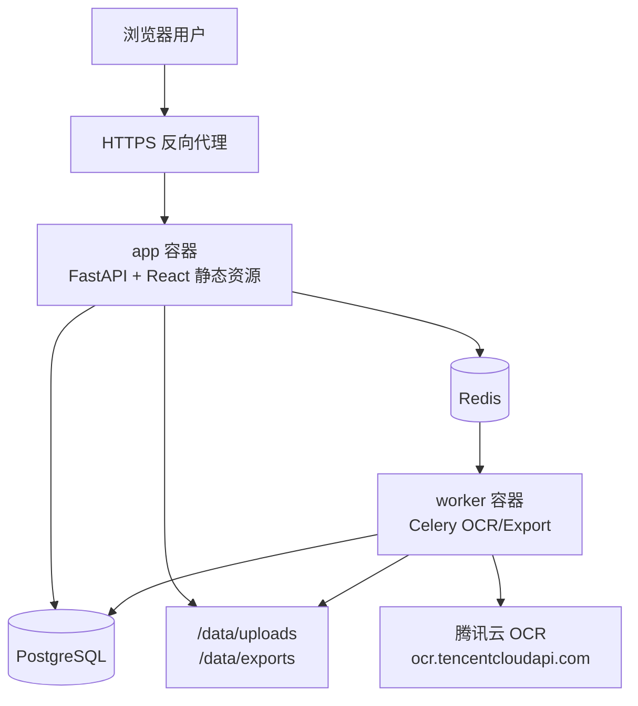
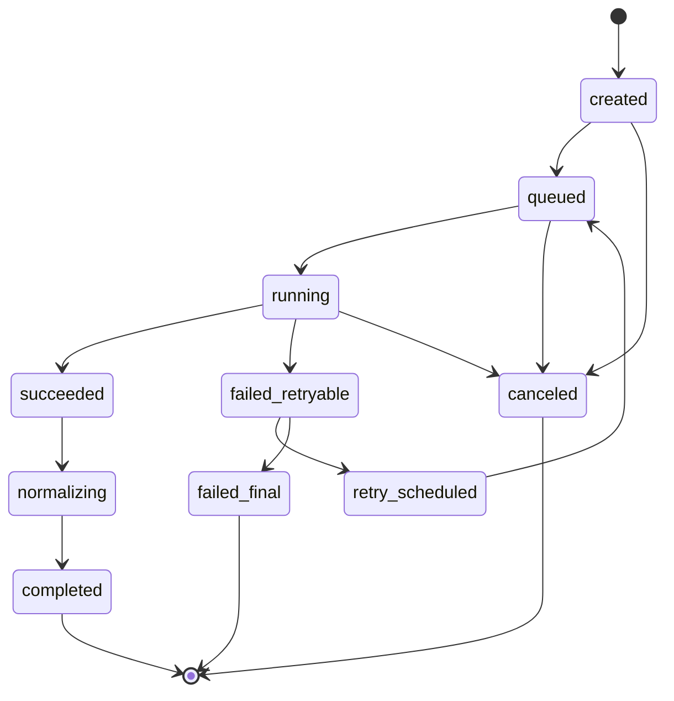

# 发票集中存储与腾讯云 OCR 识别系统完整设计

版本：v0.1

日期：2026-07-09

适用阶段：MVP 设计与后续实现依据

## 1. 项目定位

本项目是一个可私有化部署的“发票资料库 + OCR 识别工作台”。它面向出差、采购、餐饮、交通、住宿、办公采购等场景，帮助用户集中存储发票原件，自动识别票面字段，人工校对后检索、归档、导出。

系统不定位为完整报销审批系统，也不定位为税务申报或财务入账系统。MVP 只完成发票的集中管理、腾讯云 OCR 识别、校对、重复检测、查询和导出闭环。

## 2. 设计目标

1. 在 `linux x86_64` 架构上交付 Docker 镜像。
2. 用户部署时只需填写腾讯云 `SecretId` 和 `SecretKey` 即可接入 OCR。
3. OCR 识别固定接入腾讯云 `VatInvoiceOCR`。
4. 系统前置校验腾讯云官方限制，减少无效调用和额度浪费。
5. 支持发票原件、OCR 原始响应、结构化字段和人工校对记录长期保存。
6. 支持普通用户、财务用户、管理员三类角色。
7. 支持 mock OCR，确保无真实腾讯云密钥时也能本地开发和 CI 测试。
8. 后续实现必须以本文档和实施计划为准。

## 3. 反范围

MVP 明确不做：

- 完整报销审批流
- 税务申报
- 自动生成会计凭证或自动入账
- 发票真伪查验
- 多 OCR 供应商适配
- 企业级 SSO、LDAP、OIDC
- 原生移动 App
- 多页 PDF 自动整本识别
- 默认远程 URL 识别

二期可扩展报销单、审批、组织架构、发票查验、企业 SSO、COS/MinIO、外部财务系统集成。

## 4. 官方 OCR 约束

实现必须内置以下约束：

| 项 | 设计值 |
|---|---|
| Endpoint | `ocr.tencentcloudapi.com` |
| Action | `VatInvoiceOCR` |
| Version | `2018-11-19` |
| 默认 QPS | 10 次/秒 |
| 推荐内部默认 QPS | 8 次/秒 |
| 输入 | `ImageBase64` 优先 |
| 支持格式 | PNG、JPG、JPEG、PDF |
| 不支持格式 | GIF |
| Base64 后大小 | 不超过 10MB |
| 图片像素 | 宽高需在 20-10000px |
| PDF | `IsPdf=true`，一期仅支持单页 |
| 远程下载 | 腾讯云限制 3 秒，MVP 默认不开 |
| 必存输出 | `VatInvoiceInfos`、`Items`、`PdfPageSize`、`Angle`、`RequestId` |

## 5. 用户与角色

### 5.1 普通用户

- 上传自己的发票
- 查看自己的发票
- 编辑自己未归档的发票
- 查看 OCR 状态和失败原因
- 删除自己未处理的发票，删除为软删除

### 5.2 财务用户

- 查看授权范围内全部发票
- 校对和修正发票字段
- 处理疑似重复
- 批量确认、归档、导出
- 查看 OCR 失败原因和腾讯云 `RequestId`

### 5.3 管理员

- 管理用户、角色和权限
- 配置腾讯云 OCR 凭据
- 查看系统健康和任务队列
- 管理上传限制、存储、导出模板
- 查看审计日志
- 执行备份、恢复、升级和密钥轮换

## 6. 核心业务闭环


## 7. 技术栈

### 7.1 后端

选择：Python 3.12 + FastAPI + SQLAlchemy 2 + Alembic

理由：

- FastAPI 类型清晰，OpenAPI 自动生成，适合管理后台 API。
- Python 对图片、PDF、OCR SDK、数据导出、测试 fixture 支持成熟。
- SQLAlchemy 2 和 Alembic 能支撑长期演进的数据模型。
- 腾讯云 SDK 3.0 支持 Python，减少自维护签名风险。

### 7.2 前端

选择：React + Vite + TypeScript

理由：

- 上传队列、发票列表、详情校对、批量操作属于典型 SPA 工作台。
- TypeScript 有利于共享 API 类型和降低字段映射错误。
- Vite 构建快，适合与后端 multi-stage Docker 构建集成。

### 7.3 数据库

选择：PostgreSQL

理由：

- 支持 JSONB 保存 OCR 原始响应。
- 支持复杂筛选、索引、审计和多用户并发。
- 比 SQLite 更适合集中管理和后续企业化扩展。

### 7.4 异步队列

选择：Redis + Celery

理由：

- OCR 调用有外部限流、超时、重试和失败恢复需求。
- 上传请求不应同步等待 OCR。
- Redis 可同时承担队列、分布式限流、短期缓存。

### 7.5 文件存储

MVP 选择 Docker volume 本地文件存储：

- `/data/uploads`：发票原件
- `/data/exports`：导出文件
- `/data/tmp`：临时文件

设计 `FileStorage` 接口，后续支持 S3/MinIO/腾讯云 COS。

### 7.6 Docker 交付

业务镜像采用 multi-stage：

1. Node 阶段构建前端静态资源。
2. Python 阶段安装后端依赖。
3. Runtime 阶段复制后端和前端 dist，使用非 root 用户运行。

运行时通过 docker compose 启动：

- `app`：FastAPI + 静态前端
- `worker`：OCR 和导出异步任务，复用同一业务镜像
- `postgres`：结构化数据
- `redis`：队列与限流
- `reverse-proxy`：生产可选，推荐 Caddy/Nginx/Traefik

## 8. 系统架构



### 8.1 模块边界

| 模块 | 职责 |
|---|---|
| `core` | 配置、日志、鉴权、密钥读取、通用异常、限流基础 |
| `api` | REST 路由、请求响应模型、权限入口 |
| `domain/file` | 上传、MIME/魔数、大小、像素、PDF 单页、落盘 |
| `domain/ocr` | 腾讯云 SDK 封装、限流、错误映射、响应归一化 |
| `domain/invoice` | 发票主表、明细、状态机、人工校对、重复检测 |
| `domain/export` | CSV/XLSX/JSON 导出任务 |
| `domain/user` | 用户、角色、权限 |
| `workers` | Celery 应用、OCR 任务、导出任务、重试 |
| `frontend` | SPA 工作台、上传、列表、详情、设置 |

### 8.2 推荐目录结构

```text
.
  Dockerfile
  docker-compose.yml
  .env.example
  README.md

  backend/
    pyproject.toml
    alembic.ini
    app/
      main.py
      core/
        config.py
        security.py
        logging.py
        errors.py
        rate_limit.py
      api/
        routes/
          auth.py
          documents.py
          invoices.py
          ocr_jobs.py
          exports.py
          admin.py
      domain/
        file/
        ocr/
        invoice/
        export/
        user/
      workers/
      db/
      tests/

  frontend/
    package.json
    vite.config.ts
    src/
      app/
      pages/
      components/
      api/
      types/

  deploy/
    caddy/
    nginx/
    scripts/

  docs/
```

## 9. 上传与 OCR 流程

### 9.1 上传预校验

上传 API 必须先做本地校验：

1. 扩展名和 MIME/魔数双校验。
2. 仅允许 PNG、JPG、JPEG、PDF。
3. GIF 直接拒绝。
4. 精确计算 Base64 后大小，不超过 10MB。
5. 图片读取宽高，宽高均需在 20-10000px。
6. PDF 一期只允许单页；如果多页，返回明确错误。
7. 计算 `sha256`，用于幂等、重复上传提示和存储路径。
8. 文件落盘到 `/data/uploads/{yyyy}/{mm}/{sha256}.{ext}`。

### 9.2 OCR 作业状态机



用户侧发票状态：

- `uploaded`：文件已上传，未识别
- `recognizing`：OCR 中
- `needs_review`：识别完成，需人工校对
- `confirmed`：已人工确认
- `failed`：识别失败
- `duplicate_suspected`：疑似重复
- `archived`：已归档
- `deleted`：软删除

### 9.3 OCR 调用封装

后端只允许通过 `TencentVatInvoiceOcrClient` 调用腾讯云：

- 从环境变量读取 `TENCENTCLOUD_SECRET_ID` 和 `TENCENTCLOUD_SECRET_KEY`
- 固定 endpoint、Action、Version
- 默认 region 为 `ap-guangzhou`，可配置覆盖
- 本地文件转 Base64 传 `ImageBase64`
- PDF 自动传 `IsPdf=true` 和 `PdfPageNumber=1`
- 调用前经过 Redis 令牌桶限流
- 捕获 SDK 异常并映射为内部错误
- 日志禁止输出 Secret、Authorization、完整 Base64

## 10. OCR 结果归一化

系统必须双写：

1. `raw_ocr_payload`：腾讯云完整 JSON。
2. `invoices` 和 `invoice_items`：业务字段。

归一化规则：

- 金额使用 Decimal，不用 float。
- 日期统一为 `YYYY-MM-DD`。
- 税率统一为 Decimal，如 `0.13`。
- 发票代码、号码、税号全部按字符串保存。
- 买卖方名称只做 trim，不做过度清洗。
- 无法归一的腾讯云字段进入 `extra_fields` JSONB。
- 人工修正不覆盖原始 OCR 值，必须保留 correction log。

## 11. 重复检测

MVP 使用规则检测疑似重复：

强匹配：

- 发票代码 + 发票号码 + 开票日期 + 价税合计

弱匹配：

- 发票号码 + 开票日期 + 销售方 + 价税合计
- 全电票场景发票号码 + 开票日期 + 价税合计

疑似重复不阻止保存，但进入 `duplicate_suspected` 状态或生成 `DuplicateCheck` 记录，由财务确认。

## 12. 前端体验设计

前端是工作型后台工具，视觉基调应安静、清晰、可追溯，优先效率和可信度。

### 12.1 信息架构

- 总览
- 发票库
- 上传识别
- 待校对
- 报销/场景
- 导出记录
- 设置

### 12.2 核心页面

| 页面 | 关键能力 |
|---|---|
| 总览 | 待处理、识别失败、近 30 天金额、成功率、队列积压 |
| 上传识别 | 拖拽上传、批量队列、预校验、OCR 状态、失败重试 |
| 发票库 | 搜索、组合筛选、排序、批量操作、保存视图 |
| 发票详情 | 左侧原件预览，右侧字段校对和明细编辑 |
| 待校对 | 聚合字段缺失、金额异常、低置信度、疑似重复 |
| 导出记录 | 导出任务、下载、失败原因、导出元信息 |
| 设置 | OCR 凭据、上传限制、字段规则、存储导出、系统健康 |

### 12.3 上传体验

上传队列状态：

- 待上传
- 格式检查中
- 上传中
- 等待 OCR
- 识别中
- 待校对
- 完成
- 失败，可重试

关键文案必须直给：

- GIF 不支持：`腾讯云 VatInvoiceOCR 不支持 GIF，请转换为 PNG/JPG/PDF 后上传。`
- 文件过大：`文件 Base64 编码后可能超过 10MB，请压缩后重试。`
- PDF 多页：`PDF 需要以单页方式识别，请拆分后上传。`
- 凭证错误：`SecretId 或 SecretKey 校验失败，请在设置中更新凭证。`

### 12.4 发票详情校对

详情页采用左右对照：

- 左侧：图片/PDF 单页预览，支持缩放、旋转、适应宽度
- 右侧：字段编辑和明细表格

字段分组：

- 发票基础信息
- 购买方信息
- 销售方信息
- 金额信息
- 明细项目
- OCR 元信息

交互要求：

- 每个字段保留 OCR 原值和当前修正值。
- 金额不一致、字段为空、疑似重复要高亮。
- 支持键盘流：Tab、Enter、Esc。
- 主要操作是“确认无误”。
- 重新识别、删除、归档为次级或危险操作。

### 12.5 响应式与可访问性

- 桌面端优先，支持 1280px 以上高密度数据表格。
- 平板折叠左侧导航，详情页可上下布局。
- 手机支持上传和轻量查看，不承载完整高密度校对。
- WCAG 2.1 AA 基础目标。
- 错误状态不能只靠颜色，要有图标和文案。
- 上传区支持键盘打开文件选择。
- Toast 不承载唯一重要错误，关键错误必须留在页面内。

## 13. 安全设计

### 13.1 密钥

- Secret 只从环境变量或 Docker Secret 读取。
- 不写入数据库。
- 不写入日志。
- 不返回前端。
- 配置页只显示“已配置/未配置”和测试结果，不回显完整 SecretKey。
- 推荐使用腾讯云 CAM 子账号，不使用主账号密钥。
- 推荐最小权限，仅授予 OCR 访问权限。

### 13.2 文件安全

- 文件名不参与真实存储路径。
- 拒绝路径穿越。
- 限制文件类型、大小、像素、PDF 页数。
- 上传文件下载必须鉴权。
- 默认不开远程 URL 识别。若二期支持 URL，必须防 SSRF。

### 13.3 Web/API 安全

- 登录 Cookie 设置 `HttpOnly`、`Secure`、`SameSite=Lax`。
- 所有发票、原件、导出下载均鉴权。
- 普通用户默认只能访问自己的发票。
- 删除为软删除并审计。
- API 有请求频率限制。
- 日志脱敏税号、密钥、完整 OCR 原文。

## 14. 可观测性

必须提供：

- `GET /healthz`：进程存活
- `GET /readyz`：数据库、Redis、存储目录可用
- `GET /metrics`：可选 Prometheus 指标

关键指标：

- OCR 成功率
- OCR 失败数
- 队列积压
- 平均识别耗时
- 腾讯云错误码分布
- 上传文件量和存储占用
- 导出任务成功率

审计日志：

- 登录/登出/失败登录
- 上传、删除、修改、归档
- OCR 调用成功/失败
- 人工校对字段变更
- 导出行为
- 配置和权限变更

## 15. 测试策略

测试金字塔：

- 单元测试：60%-70%
- 集成测试：20%-30%
- E2E：5%-10%
- 手工探索：发布前补充

原则：

- 常规测试不调用真实腾讯云。
- 使用 mock OCR server 和 fixture。
- 真实 OCR 只在 `OCR_LIVE_TESTS=1` 或 release gate 中少量运行。
- Live test 只断言响应结构、`RequestId` 和解析能力，不断言金额等易变识别结果。

## 16. 部署原则

- 目标平台明确为 `linux/amd64`。
- 镜像非 root 运行。
- 固定基础镜像版本，不使用 `latest`。
- 使用 docker compose 运行 app、worker、postgres、redis。
- 数据、上传、导出必须挂载 volume。
- 生产建议 HTTPS 反代。
- 默认内部 OCR QPS 为 8。
- 容器重启不能丢数据。

完整部署步骤见 [Linux x86_64 Docker 部署指南](../deployment/linux-amd64-docker-deployment.md)。

## 17. 验收标准

MVP 最低验收：

- 可在 linux x86_64 通过 Docker 部署。
- 用户只配置 SecretId 和 SecretKey。
- 上传合法 PNG/JPG/JPEG/PDF 后可完成识别并保存结果。
- GIF、超限文件、非法像素、多页 PDF 有明确错误。
- OCR 请求符合腾讯云官方约束。
- OCR 结果保存 RequestId、VatInvoiceInfos、Items、PdfPageSize、Angle。
- 默认限流不超过 10 次/秒。
- 密钥和敏感信息不会进入日志。
- 发票可列表、筛选、详情查看、人工校对、导出。
- 普通用户不能越权访问他人发票。
- 单元、集成、E2E mock 测试通过。
- 镜像经过漏洞扫描和冒烟测试。

