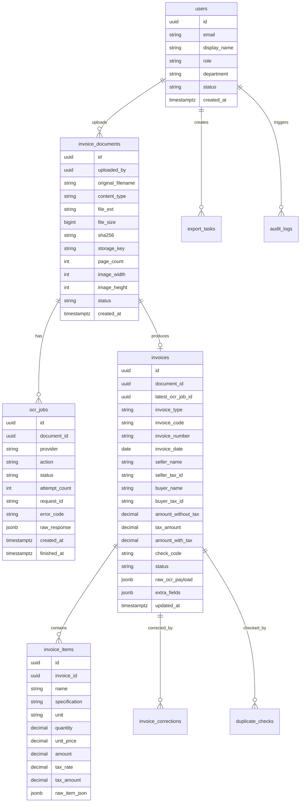

# 数据模型与 API 设计

版本：v0.1

日期：2026-07-09

## 1. 领域模型总览



## 2. 表设计

### 2.1 `users`

| 字段 | 类型 | 说明 |
|---|---|---|
| `id` | UUID | 主键 |
| `email` | String | 登录账号，唯一 |
| `password_hash` | String | 密码哈希 |
| `display_name` | String | 显示名 |
| `role` | Enum | `user`、`finance`、`admin` |
| `department` | String | 部门，可空 |
| `status` | Enum | `active`、`disabled` |
| `created_at` | Timestamp | 创建时间 |
| `updated_at` | Timestamp | 更新时间 |

### 2.2 `invoice_documents`

| 字段 | 类型 | 说明 |
|---|---|---|
| `id` | UUID | 主键 |
| `workspace_id` | UUID | 预留多空间扩展，MVP 可默认固定 |
| `uploaded_by` | UUID | 上传用户 |
| `original_filename` | String | 原始文件名 |
| `content_type` | String | MIME |
| `file_ext` | String | 扩展名 |
| `file_size` | BigInt | 原始大小 |
| `base64_size` | BigInt | Base64 后大小 |
| `sha256` | String | 文件哈希 |
| `storage_key` | String | 真实存储路径 key |
| `page_count` | Integer | PDF 页数或 1 |
| `image_width` | Integer | 图片宽 |
| `image_height` | Integer | 图片高 |
| `status` | Enum | `uploaded`、`ocr_queued`、`ocr_running`、`ocr_done`、`ocr_failed`、`deleted` |
| `created_at` | Timestamp | 上传时间 |
| `deleted_at` | Timestamp | 软删除时间 |

索引：

- `(uploaded_by, created_at)`
- `(sha256)`
- `(status, created_at)`

### 2.3 `ocr_jobs`

| 字段 | 类型 | 说明 |
|---|---|---|
| `id` | UUID | 主键 |
| `document_id` | UUID | 文件 |
| `invoice_id` | UUID | 发票，可空，归一化后关联 |
| `provider` | String | 固定 `tencent` |
| `endpoint` | String | 固定 `ocr.tencentcloudapi.com` |
| `action` | String | 固定 `VatInvoiceOCR` |
| `version` | String | 固定 `2018-11-19` |
| `region` | String | 默认 `ap-guangzhou` |
| `status` | Enum | 作业状态 |
| `attempt_count` | Integer | 尝试次数 |
| `next_retry_at` | Timestamp | 下次重试 |
| `idempotency_key` | String | 幂等键 |
| `request_id` | String | 腾讯云 `RequestId` |
| `error_code` | String | 系统错误码 |
| `provider_error_code` | String | 腾讯云错误码 |
| `error_message` | String | 脱敏错误信息 |
| `raw_request_meta` | JSONB | 请求元信息，不含 Secret/Base64 |
| `raw_response` | JSONB | 腾讯云原始响应 |
| `started_at` | Timestamp | 开始 |
| `finished_at` | Timestamp | 结束 |

唯一约束：

- `idempotency_key` 在非强制重跑场景唯一

### 2.4 `invoices`

| 字段 | 类型 | 说明 |
|---|---|---|
| `id` | UUID | 主键 |
| `document_id` | UUID | 原始文件 |
| `latest_ocr_job_id` | UUID | 最近 OCR 作业 |
| `invoice_type` | String | 发票类型 |
| `invoice_code` | String | 发票代码 |
| `invoice_number` | String | 发票号码 |
| `invoice_date` | Date | 开票日期 |
| `seller_name` | String | 销售方 |
| `seller_tax_id` | String | 销售方税号 |
| `buyer_name` | String | 购买方 |
| `buyer_tax_id` | String | 购买方税号 |
| `amount_without_tax` | Decimal(18,2) | 不含税金额 |
| `tax_amount` | Decimal(18,2) | 税额 |
| `amount_with_tax` | Decimal(18,2) | 价税合计 |
| `check_code` | String | 校验码 |
| `currency` | String | 默认 `CNY` |
| `expense_scene` | String | 出差、餐饮等 |
| `status` | Enum | 发票状态 |
| `is_duplicate_suspected` | Boolean | 是否疑似重复 |
| `raw_ocr_payload` | JSONB | 原始响应 |
| `normalized_payload` | JSONB | 归一化结果 |
| `extra_fields` | JSONB | 额外字段 |
| `confirmed_by` | UUID | 确认人 |
| `confirmed_at` | Timestamp | 确认时间 |
| `archived_at` | Timestamp | 归档时间 |

索引：

- `(invoice_code, invoice_number, invoice_date)`
- `(invoice_number)`
- `(invoice_date)`
- `(seller_name)`
- `(buyer_name)`
- `(status, created_at)`
- `(amount_with_tax)`

### 2.5 `invoice_items`

| 字段 | 类型 | 说明 |
|---|---|---|
| `id` | UUID | 主键 |
| `invoice_id` | UUID | 发票 |
| `name` | String | 服务/商品名称 |
| `specification` | String | 规格型号 |
| `unit` | String | 单位 |
| `quantity` | Decimal(18,4) | 数量 |
| `unit_price` | Decimal(18,4) | 单价 |
| `amount` | Decimal(18,2) | 金额 |
| `tax_rate` | Decimal(8,4) | 税率 |
| `tax_amount` | Decimal(18,2) | 税额 |
| `raw_item_json` | JSONB | 原始明细 |

### 2.6 `invoice_corrections`

| 字段 | 类型 | 说明 |
|---|---|---|
| `id` | UUID | 主键 |
| `invoice_id` | UUID | 发票 |
| `field_path` | String | 字段路径，如 `seller_name` |
| `ocr_value` | Text | OCR 原值 |
| `old_value` | Text | 修改前值 |
| `new_value` | Text | 修改后值 |
| `changed_by` | UUID | 修改人 |
| `changed_at` | Timestamp | 修改时间 |

### 2.7 `duplicate_checks`

| 字段 | 类型 | 说明 |
|---|---|---|
| `id` | UUID | 主键 |
| `invoice_id` | UUID | 当前发票 |
| `matched_invoice_id` | UUID | 匹配发票 |
| `rule` | String | 匹配规则 |
| `score` | Decimal | 匹配分 |
| `status` | Enum | `pending`、`confirmed_duplicate`、`ignored` |
| `created_at` | Timestamp | 创建时间 |

### 2.8 `export_tasks`

| 字段 | 类型 | 说明 |
|---|---|---|
| `id` | UUID | 主键 |
| `format` | Enum | `xlsx`、`csv`、`json`、`zip` |
| `filters` | JSONB | 导出筛选 |
| `status` | Enum | `queued`、`running`、`completed`、`failed` |
| `storage_key` | String | 导出文件 |
| `created_by` | UUID | 创建人 |
| `expires_at` | Timestamp | 下载过期 |

### 2.9 `audit_logs`

| 字段 | 类型 | 说明 |
|---|---|---|
| `id` | UUID | 主键 |
| `actor_id` | UUID | 操作人 |
| `action` | String | 操作 |
| `resource_type` | String | 资源类型 |
| `resource_id` | UUID | 资源 ID |
| `metadata` | JSONB | 脱敏元信息 |
| `ip_address` | String | IP |
| `user_agent` | String | UA |
| `created_at` | Timestamp | 时间 |

## 3. REST API 设计

统一前缀：`/api/v1`

响应格式：

```json
{
  "data": {},
  "request_id": "app-trace-id"
}
```

错误格式：

```json
{
  "error": {
    "code": "OCR_FILE_TOO_LARGE",
    "message": "文件 Base64 编码后超过 10MB",
    "retryable": false,
    "provider": "tencent",
    "provider_code": "LimitExceeded.TooLargeFileError",
    "provider_request_id": "..."
  },
  "request_id": "app-trace-id"
}
```

### 3.1 鉴权

```http
POST /api/v1/auth/login
POST /api/v1/auth/logout
GET  /api/v1/auth/me
```

### 3.2 上传文件

```http
POST /api/v1/documents
Content-Type: multipart/form-data
```

参数：

- `file`：文件
- `scene`：业务场景，可选
- `auto_ocr`：默认 `true`
- `idempotency_key`：可选

成功响应：

```json
{
  "data": {
    "document_id": "uuid",
    "ocr_job_id": "uuid",
    "status": "ocr_queued",
    "sha256": "..."
  }
}
```

### 3.3 文件查询

```http
GET    /api/v1/documents
GET    /api/v1/documents/{document_id}
GET    /api/v1/documents/{document_id}/download
DELETE /api/v1/documents/{document_id}
```

删除必须软删除并写审计日志。

### 3.4 OCR 作业

```http
POST /api/v1/documents/{document_id}/ocr-jobs
GET  /api/v1/ocr-jobs/{job_id}
POST /api/v1/ocr-jobs/{job_id}/retry
POST /api/v1/ocr-jobs/{job_id}/cancel
```

创建 OCR 作业时，系统根据 `document_id + action + pdf_page_number + sha256` 生成幂等键。

### 3.5 发票管理

```http
GET   /api/v1/invoices
GET   /api/v1/invoices/{invoice_id}
PATCH /api/v1/invoices/{invoice_id}
POST  /api/v1/invoices/{invoice_id}/confirm
POST  /api/v1/invoices/{invoice_id}/archive
DELETE /api/v1/invoices/{invoice_id}
```

列表筛选参数：

- `status`
- `invoice_date_from`
- `invoice_date_to`
- `uploaded_from`
- `uploaded_to`
- `amount_min`
- `amount_max`
- `seller_name`
- `buyer_name`
- `invoice_number`
- `invoice_code`
- `scene`
- `file_type`
- `duplicate`
- `q`

### 3.6 明细项

```http
GET /api/v1/invoices/{invoice_id}/items
PUT /api/v1/invoices/{invoice_id}/items
```

明细修改必须生成 correction log。

### 3.7 重复检测

```http
GET  /api/v1/invoices/{invoice_id}/duplicate-checks
POST /api/v1/duplicate-checks/{check_id}/confirm
POST /api/v1/duplicate-checks/{check_id}/ignore
```

### 3.8 导出

```http
POST /api/v1/exports
GET  /api/v1/exports
GET  /api/v1/exports/{export_id}
GET  /api/v1/exports/{export_id}/download
```

导出请求：

```json
{
  "format": "xlsx",
  "scope": "filtered_invoices",
  "filters": {
    "status": ["confirmed"],
    "invoice_date_from": "2026-01-01",
    "invoice_date_to": "2026-01-31"
  },
  "include_items": true,
  "include_ocr_meta": true
}
```

XLSX 导出包含：

- `Invoices`
- `Items`
- `OCR Jobs`
- `Export Metadata`

### 3.9 管理与设置

```http
GET  /api/v1/admin/ocr-provider/status
POST /api/v1/admin/ocr-provider/test
GET  /api/v1/admin/system/health
GET  /api/v1/admin/audit-logs
GET  /api/v1/admin/users
POST /api/v1/admin/users
PATCH /api/v1/admin/users/{user_id}
```

`ocr-provider/status` 只能返回：

```json
{
  "configured": true,
  "endpoint": "ocr.tencentcloudapi.com",
  "action": "VatInvoiceOCR",
  "version": "2018-11-19",
  "qps": 8
}
```

不得返回 SecretKey。

## 4. 错误码映射

| 系统错误码 | HTTP | 可重试 | 触发条件 |
|---|---:|---|---|
| `OCR_UNSUPPORTED_FILE_TYPE` | 400 | 否 | 文件类型不在 PNG/JPG/JPEG/PDF |
| `OCR_GIF_NOT_SUPPORTED` | 400 | 否 | GIF |
| `OCR_FILE_TOO_LARGE` | 400 | 否 | Base64 后超过 10MB |
| `OCR_INVALID_IMAGE_SIZE` | 400 | 否 | 像素不在 20-10000px |
| `OCR_PDF_MULTI_PAGE_NOT_SUPPORTED` | 400 | 否 | 多页 PDF |
| `OCR_PROVIDER_AUTH_FAILED` | 502 | 否 | SecretId/SecretKey 错误 |
| `OCR_PROVIDER_RATE_LIMITED` | 503 | 是 | 腾讯云限流 |
| `OCR_PROVIDER_TIMEOUT` | 503 | 是 | 网络或服务超时 |
| `OCR_PROVIDER_UNOPENED` | 502 | 否 | 腾讯云服务未开通 |
| `OCR_PROVIDER_IN_ARREARS` | 502 | 否 | 欠费 |
| `OCR_RECOGNITION_EMPTY` | 422 | 否 | 未检测到文本 |
| `OCR_PROVIDER_UNKNOWN_ERROR` | 502 | 是 | 未知临时错误 |

## 5. 字段映射

`VatInvoiceInfos` 是键值数组。实现中建立 `TencentVatInvoiceMapper`，按中文字段名映射至标准字段。

| 腾讯云字段名 | 标准字段 |
|---|---|
| `发票代码` | `invoice_code` |
| `发票号码` | `invoice_number` |
| `开票日期` | `invoice_date` |
| `购买方名称` | `buyer_name` |
| `购买方识别号` | `buyer_tax_id` |
| `销售方名称` | `seller_name` |
| `销售方识别号` | `seller_tax_id` |
| `合计金额` | `amount_without_tax` |
| `合计税额` | `tax_amount` |
| `小写金额` 或 `价税合计` | `amount_with_tax` |
| `校验码` | `check_code` |
| `发票类型` | `invoice_type` |

金额字段可能包含 `¥`、逗号、中文括号，归一化前先清理符号。清理失败时原值进入 `extra_fields`，标准字段置空并进入待校对。

## 6. 幂等与重试

上传幂等：

- 客户端可传 `Idempotency-Key`
- 服务端计算 `sha256`
- 同用户同场景同 hash 可返回已有文件，也可创建重复记录但标记疑似重复

OCR 幂等：

- `document_id + action + pdf_page_number + sha256`
- 已有 `queued/running/completed` 时返回已有 job
- 强制重跑创建新 job version

重试：

- 最大 3 次
- 退避：10s、30s、2min
- 只重试限流、网络超时、腾讯云 5xx 或未知临时错误
- 不重试文件格式、大小、像素、鉴权、欠费、服务未开通

